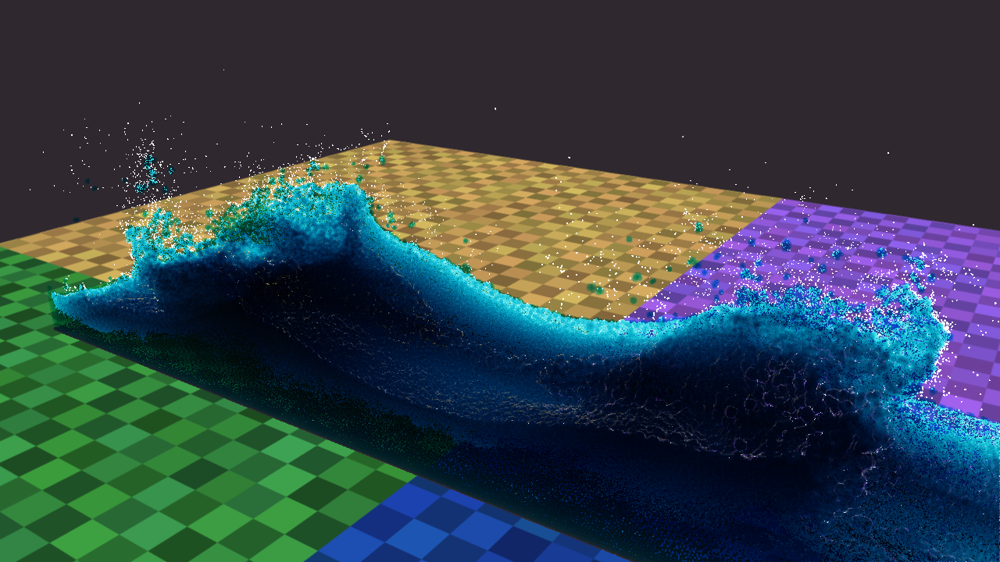
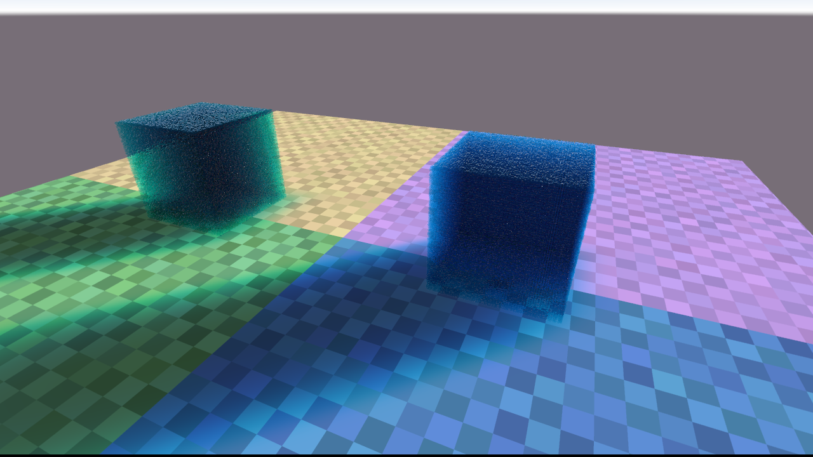
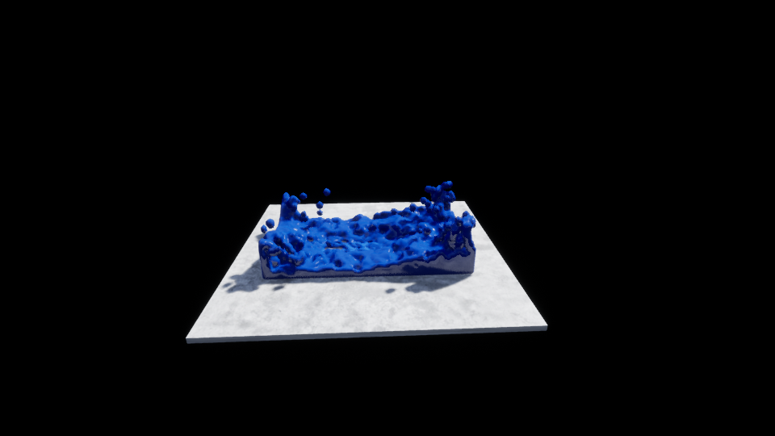

# SebLague Fluid-Sim — UE4 Compute Shader Port

This UE 4.26 project recreates the final `Fluid ScreenSpace 2` demo from
[SebLague/Fluid-Sim](https://github.com/SebLague/Fluid-Sim) with Unreal global
compute shaders.



| Initial 410,758-particle state | Optional Marching Cubes path |
| --- | --- |
|  |  |

## Requirements

- Unreal Engine 4.26
- Windows with an SM5/D3D11-capable GPU
- Visual Studio C++ toolchain supported by UE 4.26

## Download and build

```powershell
git clone https://github.com/RikkaBunny/UE4-Compute-SPH-Water-Demo.git
cd UE4-Compute-SPH-Water-Demo
```

Generate Visual Studio project files from `WaterSimulation.uproject`, build the
`WaterSimulationEditor` Development target, then open the project. Generated
folders and binaries are intentionally excluded; Unreal recreates them on the
new machine.

## Run the demo

Open the project and play:

`/Game/ComputeWater/Maps/ComputeWater_Demo`

Hold the left mouse button anywhere inside the game viewport and drag across
the floor plane. The container follows with limited speed and acceleration;
releasing the button lets it finish the short move and stop, producing a
fluid slosh. `Require Cursor Over Container` can be enabled if restricted
grabbing is preferred.

The default `ComputeWaterActor` enables `Use Source Screen Space 2 Preset`.
That preset overrides the generic component controls with the source scene's
particle count, simulation, foam, renderer, environment, light, and camera
values.

## Source preset

- Two `59 x 59 x 59` spawn volumes: **410,758 fluid particles**
- Bounds: `36 x 12 x 8 m` in the Unity scene
- Smoothing radius `0.2`, density `630`
- Pressure `288`, near pressure `2.16`, viscosity `0`
- Gravity `-10`, collision damping `0.95`, three substeps
- Foam capacity `1,024,000` with the source trapped-air, spray, bubble,
  lifetime, scale, and buoyancy rules
- Depth radius `0.10 m`, thickness radius `0.07 m`
- Five horizontal/vertical bilateral smoothing iterations using the source
  `0.02 m / 32 px / 0.45 / 3.7` settings
- Source extinction `(4.75, 0.53, 0.33) * 1.31` and refraction `1.25`
- Source four-colour tiled floor, procedural colour variation, sky, sun, and
  blurred coloured fluid shadow
- Source camera position and Unity 60-degree vertical FOV. UE keeps the
  equivalent 91.492844-degree horizontal FOV reference while preserving the
  vertical FOV dynamically at any viewport aspect ratio.

## GPU pipeline

All per-frame simulation and rendering data stays on the GPU:

1. External forces and predicted positions
2. 3D spatial hashing
3. GPU count sort and recursive prefix scan
4. Particle reorder and spatial offsets
5. Density and near-density evaluation
6. Pressure, near-pressure, trapped-air generation, and optional viscosity
7. Box collision and integration
8. Foam/spray/bubble classification, motion, compaction, and lifetime update
9. Atomic compute splats for fluid depth, foam-depth-tested thickness, foam,
   and sun shadow, including the source's true sub-pixel projected radii
10. Compute bilateral depth/thickness filtering and Gaussian shadow filtering
11. Full-screen source-style normal reconstruction, Fresnel reflection,
    refraction, extinction, foam composition, floor, and sky

There is no per-frame particle, foam, depth, or mesh readback to the CPU.

## Moving container

`ComputeWaterActor` supplies the default mouse interaction. The useful drag
settings are exposed under `Compute Water | Container Drag`:

- `Enable Mouse Drag`
- `Require Cursor Over Container`
- `Drag Responsiveness`
- `Drag Max Speed Cm Per Second`
- `Drag Acceleration Cm Per Second Squared`

Camera and interaction controls:

- Hold the right mouse button and move the mouse to look around.
- Use `W`, `A`, `S`, and `D` to fly horizontally while looking.
- Use `Q` and `E` to fly down and up.
- Press and drag the left mouse button to move the simulation container.
- Releasing the right mouse button restores the cursor at its previous position,
  ready for container dragging.

Container motion is not limited to the built-in mouse control. Moving the
actor from Blueprint or C++ is detected by `ComputeWaterComponent` as well.
The component converts the container's world velocity change into a local,
opposite moving-frame impulse for the fluid and white particles. Its response
can be tuned under `SPH Fluid | Container Motion` with `Apply Container
Inertia`, `Container Inertia Scale`, and `Max Container Acceleration`.

The interactive control translates the box along its local floor plane. Box
rotation is deliberately not part of this control because the current gravity
and collision model are expressed in the container's local axes.

## Main files

- `Shaders/Private/SPHFluid.usf` — 3D SPH, hash/sort/scan, white particles,
  and optional Marching Cubes generation
- `Shaders/Private/FluidScreenSpace.usf` — compute splats, filters, shadow,
  environment, and final composition
- `Source/WaterSimulation/Private/ComputeWaterComponent.cpp` — UE render
  resources and dispatch graph
- `Source/WaterSimulation/Private/WaterSimulationShaders.h` — simulation
  global-shader declarations
- `Source/WaterSimulation/Private/FluidScreenSpaceShaders.h` — screen-space
  global-shader declarations

## UE-specific adaptations

The mathematical stages and scene values follow the source, but this is a
source-level port rather than a binary-identical Unity render:

- Unity Y-up/metres are converted to UE Z-up/centimetres.
- Initial grid order, spatial-hash cell order, random foam cylinder basis,
  and light-space bounds are evaluated in source Unity axis order before the
  results are converted back to UE coordinates.
- D3D11-compatible `StructuredBuffer<uint>` float-bit buffers replace Unity
  float render textures for atomic depth and filtered intermediate data.
- Compute splats replace Unity's indirect billboard raster passes.
- Foam centre depth is kept in view-Z space, copied into the thickness depth
  test, and the source foam-capacity indicator is drawn along the screen edge.
- The random generator produces the same distributions, but not Unity's exact
  CPU random sequence, so individual particles are not frame-for-frame
  identical.
- The UE view extension performs the final full-screen composition after
  tonemapping and explicitly converts the source shader's linear output to
  the SDR sRGB target, matching Unity's Linear colour-space backbuffer write.

Disable `Use Source Screen Space 2 Preset` to use the exposed generic component
settings or the optional particle/Marching Cubes render paths. `ResetFluid` is
available from Blueprint and C++.

## Platform

Requires an SM5-capable RHI. Built and runtime-validated with UE 4.26 on
D3D11. Both the editor and standalone Development targets compile. The full
source preset completes timed 16:9 and 4:3 dynamic runs without shader,
assert, ensure, GPU-device-loss, or fatal errors.

## Credits and license

This port is based on [Sebastian Lague's Fluid-Sim](https://github.com/SebLague/Fluid-Sim)
and its `Fluid ScreenSpace 2` scene. The original project and this UE4 port
are distributed under the [MIT License](LICENSE).
